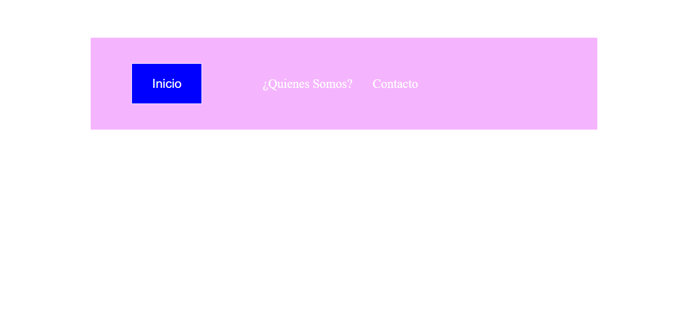

<h1>Taller Unidad 9: Karina Rojas Tavera</h1>

<h2>Información</h2>

Curso: Full Stack Basico-Grupo 1 

Profesor: Cristian Patiño

<h2>punto 1: Link de figma</h2>
<a href="https://www.figma.com/file/jbE6XH0de0AaiYEcrZ9tgp/KARINA-ROJAS-TAVERA-TABLERO?type=design&node-id=0-1&t=7I7M5oPMSguVWixv-0" target="_blank">Link de Figma</a>  

<a href="https://karinarojastavera.github.io/taller-9-fullstactk/" target="_blank">Link de la Pagina</a>

<h2>PUNTO 2: THML</h2>

https://github.com/KarinaRojasTavera/taller-9-fullstactk
<h2>PUNTO 3: CSS </h2>

<a href="https://karinarojastavera.github.io/taller-9-fullstactk/" target="_blank">Link de Pagina</a> 

<h2>PUNTO 4: </h2>

<h2>PUNTO 5: </h2>

<h2>PUNTO 6: </h2>

<h2>PUNTO 7-8: </h2>

<h2>PUNTO 9: </h2>

