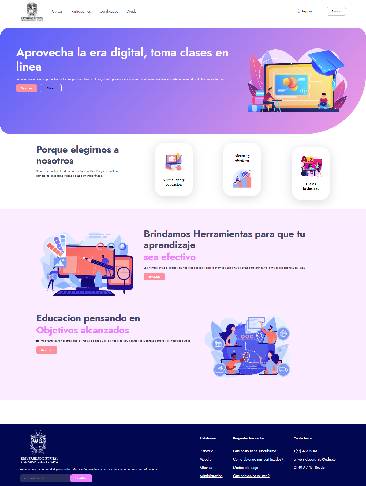

<h1>Taller 9: Karina Rojas Tavera</h1>

<h2>Información</h2>

Curso: Full Stack Basico-Grupo 1 

Profesor: Cristian Patiño

<h2>punto 1: Link de figma</h2>
<a href="https://www.figma.com/file/jbE6XH0de0AaiYEcrZ9tgp/KARINA-ROJAS-TAVERA-TABLERO?type=design&node-id=0-1&t=7I7M5oPMSguVWixv-0" target="_blank">Link de Figma</a>  
<h2>PUNTO 2: THML </h2>

<h3>PUNTO 3: CSS </h3>

